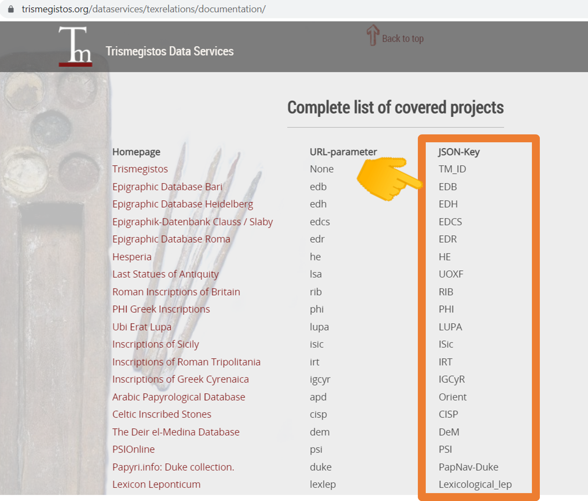

# Inscriptiones Identifier Resolver
## 1. Background                
Epigraphers can obtain [Trismegistos](https://www.trismegistos.org/) Identifiers and other digital corpora identifiers from the [Trismegistos TexRelations MatcherAPI](https://www.trismegistos.org/dataservices/texrelations/documentation/) by providing the different source identifiers. This process takes time because epigraphers need to fetch TM IDs by providing them one-by-one from different source IDs; but it is also a non-trivial task for most epigraphers to query the API directly. **The Inscriptiones Identifier Resolver (IDR)** helps the epigrapher to fetch the ids in a more efficient, user friendly and less time-consuming way.

**Inscriptiones Identifier Resolver (IDR)** is the tool to fetch *Trismegistos Identifiers* (TM ID) using the `TexRelations Matcher API` by providing the different sources of identifiers and vice versa. For instance, user uploads a CSV (input) file with inscription IDs from a project partnered with Trismegistos, and IDR returns a CSV (output) file with the IDs from other partner projects requested by the user, along with the original IDs. A simple web-based user interface makes this a more user-friendly task.

## 2. Approach
We can achieve this process using the following technologies:
   - [Trismegistos TexRelations MatcherAPI](https://www.trismegistos.org/dataservices/texrelations/documentation/)
   - JavaScript for backend
   - HTML/CSS for front-end (GUI)

## 3. Methods
IDR has two main methods: a single identifier resolver and a multiple identifiers resolver.

### 3.1 Single Identifier Resolver
*Example scenario: I have a single ID from I.Sicily and I want to get all the corresponding TM IDs and IDs of othe same inscription in other projects.*

In this method, the user selects the data source and provides the relevant single ID with which to fetch the other data source IDs, including the TM ID (discussed in detail in section 4).

### 3.2 Multiple Identifiers Resolver
*Example scenario A: I have a CSV file with combination of multiple I.Sicily IDs and want to get all corresponding TM IDs.*

*Example scenario B: I have a CSV file with multiple EDH IDs and want to get all corresponding IDs in other projects.*

In this method, the user provides a CSV file that includes the known identifiers as input in order to fetch the corresponding TM IDs; or the user provides TM IDs as input in order to obtain other corresponding data source IDs.

- **Input File format (CSV)**

  The input file format must be in the required format. The required format is as follows:
   
  
        
  In the above figure, the column headers of the CSV file are highlighted in orange. The first column should be your data source ID (optional). In this example, we have used I.Sicily data as the source ID, with the heading 'Id'. Other column headers must be in the JSON_Key format provided in the `Trismegistos Matcher API` data sources (see figure below). The values in each column must be formatted as a *number*.
     
  

## 4. GUI (Graphical User Interface)
This tool has three pages (Home, [single ID](single.html) and [multiple ID](advance.html)). The *Home page* provides a project overview. 

### Single ID Resolver

The *Single ID Resolver* page is the interface for fetching the different source IDs corresponding to the provided ID.

  
  *Figure 1: Single ID Resolver (First Look)*

To use the `Single ID Resolver`, select the source of your input ID from the dropdown menu on the left; enter the ID number in the field on the right; and select `Go`. You can test what happens if you input `ISic000001`. Don't forget the prefix *ISic*.

  
  *Figure 2: Single ID Resolver after fetching the IDs*
  

### Multiple ID Resolver

The *Multiple ID resolver* page returns multiple IDs in response to the input CSV file. Use the `Browse` button to select and upload the CSV file.

The user selects the input column(s) from the CSV file that s/he wants to use to fetch the new IDs. If the user selects the *Trismegistos (TM_ID)* column, IDR should fetch any known corresponding IDs from other data sources. When the user selects the *TM_ID* column, the other columns in the grid will be disabled, and the `Fetch` button will appear on the page. 

When clicking the `Fetch` button, the user will be presented with another menu listing all the available data sources. The user selects the required data sources that s/he wishes to be searched for corresponding IDs and downloaded.

After clicking on the `Apply` button, the *Resolver* will fetch the data from the `Trismegistos Matcher API`; progress is reported on the pop-up screen and can be paused / interrupted (and results to date downloaded) at any time.

After completing the process, the user can download the file in a CSV format to their local computer.

## 5. Contributors
- [Jonathan Prag (Oxford, UK)](https://www.classics.ox.ac.uk/people/dr-jonathan-prag)
- [Imran Asif (Oxford, UK)](https://www.classics.ox.ac.uk/people/dr-imran-asif)

## 6. Acknowledgements
The Inscriptiones Identifier Resolver makes use of the [Trismegistos](https:/www.trismegistos.org/) [TexRelations Matcher API](https://www.trismegistos.orgdataservices/texrelations/documentation/) and the TM data available under a [CC-BY-SA4.0 licence](https://creativecommons.org/licenses/by-sa/4.0/).

For more on the **Trismegistos** project, see: 

    M. Depauw / T. Gheldof, 'Trismegistos. An interdisciplinary Platform for AncientWorld Texts and Related Information', 
    in: Ł. Bolikowski, V. Casarosa, P. Goodale, N. Houssos, P. Manghi, J. Schirrwagen (edd.), Theory and Practice of 
    DigitalLibraries - TPDL 2013 Selected Workshops (Communications in Computer andInformation Science 416), 
    Cham: Springer 2014, pp. 40–52.

